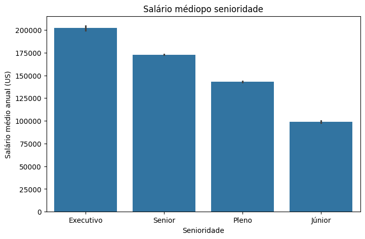

# 📊 Data Science Portfolio | Alura Immersion


---

## About the Project | Sobre o Projeto

**EN 🇬🇧**
This repository contains practical projects developed during the **Alura Data Science Immersion**. It is structured as a **Data Science portfolio project**, focusing on data analysis, exploration, and insight generation using **Python and Jupyter Notebooks**.

**PT 🇧🇷 / 🇵🇹**
Este repositório reúne projetos práticos desenvolvidos durante a **Imersão Data Science da Alura**. O projeto foi estruturado como um **projeto de portfólio em Data Science**, com foco em análise de dados, exploração e geração de insights utilizando **Python e Jupyter Notebooks**.

---

## 🎯 Purpose | Objetivo

**EN**

* Apply Data Science fundamentals in real datasets
* Perform exploratory data analysis (EDA)
* Extract insights from data
* Build a strong Data Science portfolio

**PT**

* Aplicar fundamentos de Data Science em dados reais
* Realizar análise exploratória de dados (EDA)
* Extrair insights a partir dos dados
* Construir um portfólio sólido em Data Science

---

## 🧠 Skills Demonstrated | Competências Demonstradas

**EN**

* Python for data analysis
* Exploratory Data Analysis (EDA)
* Data cleaning and preprocessing
* Data visualization
* Analytical thinking and insight generation
* Use of Jupyter Notebooks for data projects

**PT**

* Python aplicado à análise de dados
* Análise Exploratória de Dados (EDA)
* Limpeza e preparação de dados
* Visualização de dados
* Pensamento analítico e geração de insights
* Uso de Jupyter Notebooks em projetos de dados

---

## Repository Structure | Estrutura do Repositório

```
data-science-alura-immersion/
│
├── images
│   └── Sample images and graphics files (png)
├── Imersão_Alura_DS_A1.ipynb
├── Imersão_Alura_DS_A2.ipynb
├── Imersão_Alura_DS_A3.ipynb
└── README.md
```

---

## Requirements | Requisitos

**EN**

* Python 3.9 or higher
* Jupyter Notebook or Google Colab

**PT**

* Python 3.9 ou superior
* Jupyter Notebook ou Google Colab

---

App Features | Funcionalidades da Aplicação

**EN 🇬🇧**
  
  End-to-end Data Science workflow developed during the Alura Data Science Immersion
  
  Exploratory Data Analysis (EDA) with structured datasets
  
  Data cleaning, transformation, and preprocessing
  
  Statistical analysis and descriptive metrics
  
  Data visualization to identify patterns and trends
  
  Use of Python libraries for data manipulation and analysis
  
  Jupyter Notebook–based experimentation and documentation
  
  Reproducible and portfolio-oriented project structure

**PT 🇧🇷 / 🇵🇹**

  Fluxo completo de Data Science desenvolvido durante a Imersão de Data Science da Alura
  
  Análise Exploratória de Dados (EDA) com datasets estruturados
  
  Limpeza, transformação e preparação de dados
  
  Análise estatística e métricas descritivas
  
  Visualização de dados para identificação de padrões e tendências
  
  Uso de bibliotecas Python para manipulação e análise de dados
  
  Experimentação e documentação via Jupyter Notebooks
  
  Estrutura reprodutível e orientada a portfólio

## ▶️ How to Run | Como Executar

**EN**

1. Clone the repository:
  - git clone: https://github.com/ezequielcabeja/data-science-alura-immersion.git
  - Extract the .zip file and enter the directory.

2. Navigate to the project folder:

```bash
cd data-science-alura-immersion
```

### Option A — Jupyter Notebook / Google Colab

3. Launch Jupyter Notebook:

```bash
jupyter notebook
```

4. Run the notebooks in order:

* A1 → Introduction and basic analysis
* A2 → Exploratory analysis
* A3 → Insights and conclusions

### Option B — Visual Studio Code (VS Code)

3. Install the VS Code extensions:

* **Python** (Microsoft)
* **Jupyter** (Microsoft)

4. Open the project folder:

```bash
code data-science-alura-immersion
```

5. Open any `.ipynb` file, select a Python kernel and run the cells.

---

**PT**


1. Clone o repositório:
 - git clone https://github.com/ezequielcabeja/data-science-alura-immersion.git
 - Extraia o .zip e entre no diretório

2. Acesse a pasta do projeto:

```bash
cd data-science-alura-immersion
```

### Opção A — Jupyter Notebook / Google Colab

3. Abra o Jupyter Notebook:

```bash
jupyter notebook
```

4. Execute os notebooks em ordem:

* A1 → Introdução e análise inicial
* A2 → Análise exploratória
* A3 → Insights e conclusões

### Opção B — Visual Studio Code (VS Code)

3. Instale as extensões no VS Code:

* **Python** (Microsoft)
* **Jupyter** (Microsoft)

4. Abra a pasta do projeto:

```bash
code data-science-alura-immersion
```

5. Abra qualquer arquivo `.ipynb`, selecione o interpretador Python e execute as células.

---

## 📈 Key Visualizations | Gráficos e Insights Principais

**EN 🇬🇧**
Below are some key visualizations generated during the analysis, highlighting important patterns and insights discovered in the datasets. These graphs demonstrate the practical application of data analysis and visualization techniques.

**PT 🇧🇷 / 🇵🇹**
Abaixo estão algumas visualizações-chave geradas durante as análises, destacando padrões e insights importantes descobertos nos datasets. Estes gráficos demonstram a aplicação prática de técnicas de análise e visualização de dados.
1️⃣ Average Salary by Seniority | Salário Médio por Senioridade

EN 🇬🇧
This bar chart shows the average annual salary by seniority level. The results highlight a clear progression in compensation as seniority increases, with executive-level positions earning significantly higher salaries compared to junior roles. This visualization helps illustrate how experience and responsibility directly impact earnings in the data-related job market.

PT 🇧🇷 / 🇵🇹
Este gráfico de barras apresenta o salário médio anual por nível de senioridade. Os dados evidenciam uma progressão clara de remuneração à medida que a senioridade aumenta, com cargos executivos recebendo salários significativamente mais elevados em comparação aos níveis júnior. A visualização demonstra como experiência e responsabilidade impactam diretamente os ganhos no mercado de dados.



2️⃣ Overall Salary Distribution | Distribuição Geral dos Salários

EN 🇬🇧
This histogram displays the overall distribution of annual salaries in the dataset. The distribution is right-skewed, with most professionals earning within a mid-range salary band, while a smaller number of high-income outliers extend the upper tail. This pattern is typical in salary data and highlights income concentration across roles.

PT 🇧🇷 / 🇵🇹
Este histograma mostra a distribuição geral dos salários anuais presentes no dataset. A distribuição é assimétrica à direita, com a maioria dos profissionais concentrada em uma faixa salarial intermediária, enquanto um número menor de salários elevados forma a cauda superior. Esse comportamento é comum em dados salariais e evidencia a concentração de renda entre cargos específicos.


3️⃣ Salary Distribution by Seniority (Boxplot) | Distribuição Salarial por Senioridade

EN 🇬🇧
This boxplot compares the salary distributions across different seniority levels, revealing not only differences in median salaries but also variability and outliers. Higher seniority levels show wider salary ranges and more extreme values, indicating greater dispersion and the presence of high-paying positions at senior and executive levels.

PT 🇧🇷 / 🇵🇹
Este boxplot compara a distribuição dos salários entre os diferentes níveis de senioridade, evidenciando não apenas as diferenças de mediana, mas também a variabilidade e a presença de outliers. Níveis mais altos de senioridade apresentam maior dispersão salarial e valores extremos, indicando oportunidades de remuneração mais elevadas em cargos sênior e executivos.


## Datasets Used | Conjuntos de Dados Utilizados

**EN**

* Public datasets provided during the Alura Data Science Immersion
* Structured datasets for exploratory data analysis and insight extraction

**PT**

* Datasets públicos disponibilizados durante a Imersão Data Science da Alura
* Conjuntos de dados estruturados para análise exploratória e geração de insights

---

## 👤 Author | Autor

Developed by / Desenvolvido por:

**- [Ezequiel Tchimbaya Cachapeu Paulo](https://github.com/ezequielcabeja)**
---

## License | Licença

**EN**
This project is intended for **educational and portfolio purposes**.

**PT**
Este projeto é destinado a **fins educacionais e de portfólio**.

---

⭐ If this repository helped you, consider giving it a star!

⭐ Se este repositório te ajudou, considera deixar uma estrela!
